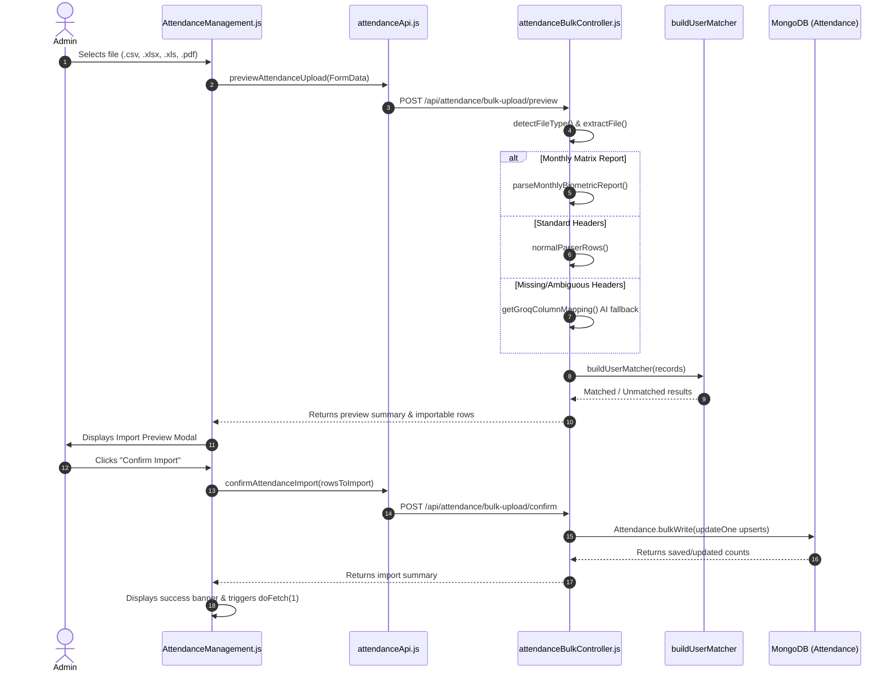

# Attendance & Biometric Flow Technical Documentation

This document provides a comprehensive technical audit and analysis of the existing Attendance module, biometric upload workflow, policy calculation engine, database schemas, and integration points in the WorkforceOS HR & Attendance Portal.

---

## 1. Attendance Page Architecture

The Attendance module spans both administrative (`/admin/attendance`) and employee self-service (`/employee/attendance`) interfaces. Below is the file map of all components, controllers, models, and utility services involved.

| Module Layer | Absolute File Path | Responsibilities & Functions |
| :--- | :--- | :--- |
| **Admin Route** | [`nextjs-frontend/app/(dashboard)/admin/attendance/page.js`](file:///c:/Users/Pooja/attendance-portal/nextjs-frontend/app/%28dashboard%29/admin/attendance/page.js) | Next.js server route wrapper rendering `AttendanceManagement` component. |
| **Employee Route** | [`nextjs-frontend/app/(dashboard)/employee/attendance/page.js`](file:///c:/Users/Pooja/attendance-portal/nextjs-frontend/app/%28dashboard%29/employee/attendance/page.js) | Next.js server route wrapper rendering `Attendance` self-service component. |
| **Admin Component** | [`nextjs-frontend/components/pages/admin/AttendanceManagement.js`](file:///c:/Users/Pooja/attendance-portal/nextjs-frontend/components/pages/admin/AttendanceManagement.js) | Main React client component. Handles filter controls, pagination, employee search, biometric file upload, preview modal, WFH assignment modal, AI anomaly triggers, and delete actions. |
| **Admin CSS** | [`nextjs-frontend/components/pages/admin/AttendanceManagement.module.css`](file:///c:/Users/Pooja/attendance-portal/nextjs-frontend/components/pages/admin/AttendanceManagement.module.css) | Scoped CSS styles for data table, filter bar, status badges, anomaly grid, and preview table. |
| **WFH Modal CSS** | [`nextjs-frontend/components/pages/admin/UrgentWfh.module.css`](file:///c:/Users/Pooja/attendance-portal/nextjs-frontend/components/pages/admin/UrgentWfh.module.css) | Scoped CSS styles for the "Add on WFH" modal overlay. |
| **Employee Component** | [`nextjs-frontend/components/pages/employee/Attendance.js`](file:///c:/Users/Pooja/attendance-portal/nextjs-frontend/components/pages/employee/Attendance.js) | Employee client component for self check-in, check-out, personal attendance log review, and calendar status. |
| **Frontend API Service** | [`nextjs-frontend/services/attendanceApi.js`](file:///c:/Users/Pooja/attendance-portal/nextjs-frontend/services/attendanceApi.js) | Axios wrapper methods: `checkIn`, `checkOut`, `getMyAttendance`, `getAllAttendance`, `assignWfh`, `previewAttendanceUpload`, `confirmAttendanceImport`, `deleteAttendance`. |
| **AI API Service** | [`nextjs-frontend/services/aiApi.js`](file:///c:/Users/Pooja/attendance-portal/nextjs-frontend/services/aiApi.js) | Axios wrapper method: `detectAnomalies`. |
| **Backend Router** | [`backend/src/routes/attendance.js`](file:///c:/Users/Pooja/attendance-portal/backend/src/routes/attendance.js) | Express route definitions for `/api/attendance/*` endpoints with `auth` and `rbac` middleware. |
| **Attendance Controller** | [`backend/src/controllers/attendanceController.js`](file:///c:/Users/Pooja/attendance-portal/backend/src/controllers/attendanceController.js) | Endpoints: `checkIn`, `checkOut`, `assignWfh`, `getMyAttendance`, `getAllAttendance`, `getDashboard`, `deleteAttendance`. |
| **Bulk Upload Controller** | [`backend/src/controllers/attendanceBulkController.js`](file:///c:/Users/Pooja/attendance-portal/backend/src/controllers/attendanceBulkController.js) | Multer middleware, file parsing (`parseCSV`, `parseExcel`, `parsePDF`, `parseMonthlyBiometricReport`, Grok AI fallback), `previewAttendanceUpload`, `confirmAttendanceImport`. |
| **Policy Service** | [`backend/src/services/attendancePolicyService.js`](file:///c:/Users/Pooja/attendance-portal/backend/src/services/attendancePolicyService.js) | Business logic engine: `buildAttendanceContext`, `calculateAttendanceRecord`, `filterCalculatedRecords`, `sortCalculatedRecords`, `isWeeklyOff`, `isShortLeave`, `isWfhLeave`. |
| **Attendance Model** | [`backend/src/models/Attendance.js`](file:///c:/Users/Pooja/attendance-portal/backend/src/models/Attendance.js) | Mongoose schema & collection for attendance records (`employeeId`, `date`, `checkIn`, `checkOut`, `workingHours`, `status`, `isLate`, `workMode`, `wfhReason`, `source`). Unique index `{ employeeId: 1, date: 1 }`. |
| **User Model** | [`backend/src/models/User.js`](file:///c:/Users/Pooja/attendance-portal/backend/src/models/User.js) | Mongoose schema for employees (`employeeId`, `biometricId`, `name`, `department`, `role`, `joiningDate`, `status`). |
| **Leave Model** | [`backend/src/models/Leave.js`](file:///c:/Users/Pooja/attendance-portal/backend/src/models/Leave.js) | Mongoose schema for leave applications (`employeeId`, `leaveType`, `leaveTypeCode`, `durationType`, `startDate`, `endDate`, `status`, `leaveMode`). |
| **CalendarEvent Model** | [`backend/src/models/CalendarEvent.js`](file:///c:/Users/Pooja/attendance-portal/backend/src/models/CalendarEvent.js) | Mongoose schema for official holidays (`title`, `date`, `endDate`, `type: 'holiday'`, `isActive`). |
| **Settings Model** | [`backend/src/models/Settings.js`](file:///c:/Users/Pooja/attendance-portal/backend/src/models/Settings.js) | Mongoose schema for global settings (`officeStartTime`, `lateThreshold`, `fullDayRequiredHours`, `halfDayRequiredHours`, `saturdayOffRule`, `weekendDays`). |

---

## 2. Current Attendance Page Workflow

### Data Loading & Fetching
- On initial mount, `AttendanceManagement.js` invokes `doFetch(1)` which calls `getAllAttendance` (`GET /api/attendance`).
- Default parameters: `page: 1`, `limit: 50`, `startDate: thisMonthStart` (1st of current month), `endDate: today`, `sortBy: 'date'`, `sortDir: 'desc'`, `activeOnly: true`.

### Available Filters & Controls
1. **Employee Filter**: Autocomplete search input (`empSearch`) + dropdown displaying `employees` fetched via `listEmployees`. Selected employee filters by `employeeId`.
2. **Department Filter**: Dropdown filtering active employees in department via regex match in backend (`req.query.department`).
3. **Date Range**: `startDate` and `endDate` date inputs.
4. **Status Filter**: `Present`, `Full Day`, `Half Day`, `Absent`, `Holiday`, `Weekend`, `On Leave`.
5. **Time Status Filter**: `On Track`, `WFH`, `Late`, `Missing Punch`, `Short Time`, `Worked on Holiday`, `Leave`, `Weekly Off`.
6. **Late Toggle**: Select dropdown for `isLate === 'true'`.
7. **Sorting Controls**: Dropdown supporting `date_desc`, `date_asc`, `workedHours_desc`, `workedHours_asc`, `shortHours_desc`, `shortHours_asc`, `overtimeHours_desc`, `overtimeHours_asc`, `lateCheckIn_desc`, `lateCheckIn_asc`.
8. **Quick Date Presets**: Preset buttons for **Today**, **This Week**, **This Month**, and **Last Month**.

### Pagination
- Managed via `page` state and `pagination` object returned from backend (`{ page, limit, total, pages }`).
- Client displays `Page X of Y · Z records` with `← Prev` and `Next →` buttons triggering `doFetch(newPage)`.

### Add WFH Action
- Admin/HR clicks **Add on WFH** button, opening the modal form (`UrgentWfh.module.css`).
- Form requires `employeeId`, `startDate`, `endDate`, and `reason`.
- Submits to `assignWfh` (`POST /api/attendance/wfh`).
- Backend validates employee active status and date range ($\le 366$ days), then executes `Attendance.bulkWrite` upsert setting `workMode: 'wfh'`, `status: 'Present'`, `isLate: false`, and `wfhReason`.

### Delete Action
- Clicking **Delete** on a record row prompts confirmation (`window.confirm`) and invokes `deleteAttendance(id)` (`DELETE /api/attendance/:id`).
- Backend executes `Attendance.findByIdAndDelete(id)`.

### AI Anomalies Functionality
- Clicking **AI Anomalies** invokes `detectAnomalies({ month, year })` (`POST /api/ai/detect-anomalies`).
- Backend analyzes monthly records for missing punches, excessive late arrivals, or short hours, returning an array of anomaly objects (`employeeName`, `severity`, `issue`, `recommendation`).

### Calculations & Synthetic WFH Presentation
- `getAllAttendance` in `attendanceController.js` fetches physical `Attendance` records and builds `attendanceContext` via `attendancePolicyService.js`.
- **Synthetic WFH Generation**: If an employee has an approved WFH leave record in `Leave` collection for a date but no physical check-in record in `Attendance`, the backend dynamically generates a synthetic record (`_id: wfh-leaveId-date`, `status: 'Present'`, `source: 'wfh_leave'`, `workMode: 'wfh'`).
- `calculateAttendanceRecord` applies global settings to compute exact values:
  * `workedHours`: `(checkOut - checkIn) / 3600000`
  * `requiredHours`: `fullDayRequiredHours` (9h) / `saturdayRequiredHours` (4h) / 0h for holidays
  * `isLate`: `checkInTime > lateThreshold`
  * `shortHours`: `Math.max(0, requiredHours - workedHours)`
  * `overtimeHours`: `Math.max(0, workedHours - requiredHours)`
  * `status`: `Present`, `Half Day`, `Absent`, `On Leave`, `Holiday`, `Weekend`
  * `timeStatus`: `On Track`, `WFH`, `Late`, `Missing Punch`, `Short Time`, `Leave`, `Worked on Holiday`, `Weekly Off`

---

## 3. Biometric Upload Workflow

Trace of complete flow when clicking **Upload Biometric**:



### Detailed Step-by-Step Function Trace

1. **File Selection**: `<input type="file" accept=".csv,.xlsx,.xls,.pdf" onChange={handleBulkUpload}>`.
2. **Accepted File Formats**: Validated in `detectFileType(file)` using file extension and magic signature checks (`.csv`, `.xlsx`, `.xls`, `.pdf`).
3. **Required Spreadsheet Columns**: Flexible detection via `findCol` matching variants for Biometric ID, Employee Code, Employee Name, Date, Check In, Check Out, Total Hours, Status.
4. **Header Validation**: `findCol(row, variants)` converts headers using `normalizeKey` to handle spaces, underscores, and casing.
5. **Row Validation**: `parseDate`, `parseTimeString`, `parsePunches` validate row values. Invalid dates or missing check-in/out on Present status mark `invalidReason`.
6. **Employee Matching**: Executed in `buildUserMatcher(users)` in strict precedence:
   1. `biometricId` / `biometricCode`
   2. `employeeId`
   3. Numeric part match on `biometricId` to numeric part of `employeeId`
   4. Exact match on `name`
   5. Fuzzy match on `name` (Levenshtein distance ratio $\le 0.25$)
7. **Date & Time Parsing**: `parseDate` converts dates to `YYYY-MM-DD`. `parseTimeString` converts times to `HH:MM`. `toDateTime` generates UTC dates.
8. **Duplicate Detection**: Evaluates `seen` Set and queries `existingKeys` (`${employeeId}:${date}`) from database.
9. **Check-In / Check-Out Calculation**: `parsePunches` extracts time punches. `checkIn = punches[0]`, `checkOut = punches[last]`.
10. **Attendance Status Calculation**: `normalizeStatus(status, checkIn)` maps status string or defaults to `Present` if check-in exists. `isLate` evaluated against 10:00 AM threshold.
11. **Database Insertion / Update**: `confirmAttendanceImport` executes `Attendance.bulkWrite` with `updateOne` upsert on `{ employeeId, date }`.
12. **Error Reporting**: Preview modal shows summary badges (`Total Rows`, `Importable`, `Matched`, `Unmatched`, `Invalid`, `Duplicates`).
13. **Success Response**: `res.json({ success: true, data: { saved, updated, skippedDuplicate, skippedInvalid } })`.
14. **Attendance Page Refresh**: Frontend calls `setUploadResult(res.data.data)` and triggers `doFetch(1)`.

---

## 4. Sample Biometric Sheet Structure

Supported columns identified in `attendanceBulkController.js`:

| Column Name Variants | Required / Optional | Expected Format | Example Value | Database Field (`Attendance` / `User`) | Validation Rule |
| :--- | :--- | :--- | :--- | :--- | :--- |
| `Biometric ID`, `Machine ID`, `User ID`, `Device ID` | Optional (Primary if present) | String / Number | `1002` | `User.biometricId` | Matched via `buildUserMatcher` |
| `Employee ID`, `Emp ID`, `Employee Code`, `Staff Code` | Optional | String | `EMP-0012` | `User.employeeId` | Matched via `buildUserMatcher` |
| `Employee Name`, `Name`, `Emp Name`, `Staff Name` | Optional | String | `Rahul Sharma` | `User.name` | Matched via exact/fuzzy Levenshtein |
| `Date`, `Attendance Date`, `Punch Date`, `Log Date` | **Required** | `YYYY-MM-DD` or `DD/MM/YYYY` | `2026-09-11` | `Attendance.date` | Validated by `parseDate` |
| `Check In`, `In Time`, `First In`, `First Punch` | Optional | `HH:MM` or `HH:MM:SS` | `09:15` | `Attendance.checkIn` | Validated by `parseTimeString` |
| `Check Out`, `Out Time`, `Last Out`, `Last Punch` | Optional | `HH:MM` or `HH:MM:SS` | `18:30` | `Attendance.checkOut` | Validated by `parseTimeString` |
| `Total Hours`, `Worked Hours`, `Work Duration` | Optional | Number | `9.25` | `Attendance.workingHours` | Computed if checkIn & checkOut exist |
| `Status`, `Attendance Status`, `Present/Absent` | Optional | String | `Present` | `Attendance.status` | Mapped via `STATUS_MAP` |

---

## 5. Employee Identification & Mapping Logic

Employee matching is executed by `buildUserMatcher(users)` in [`attendanceBulkController.js`](file:///c:/Users/Pooja/attendance-portal/backend/src/controllers/attendanceBulkController.js):

### Precedence Order
1. **Biometric ID / Code**: Matches `normalizeCode(record.biometricId)` against `user.biometricId` or `user.biometricCode`. Method: `'biometric_id'`.
2. **Employee Code**: Matches `normalizeCode(record.employeeCode)` against `user.employeeId`. Method: `'employee_code'`.
3. **Numeric Part Match**: Extracts numbers from biometric ID or employee code and matches against numeric part of `user.employeeId`. Method: `'employee_code_number'`.
4. **Exact Name Match**: Matches lowercase trimmed `record.employeeName` against `user.name`. Method: `'exact_name'`.
5. **Fuzzy Name Match**: Calculates Levenshtein distance ratio. Matches if ratio $\le 0.25$. Method: `'fuzzy_name'`.

### Fact Verification Answers
* **Is matching by name used?** **Yes**, exact and fuzzy name matching are used as fallbacks when biometric ID and employee code fail.
* **What happens when no employee matches?** Returns `{ user: null, method: 'unmatched' }`. The row has `canImport: false` and is excluded from `rowsToImport`.
* **What happens when multiple employees could match?** If multiple users share identical names/codes, `setUnique` marks the map entry as `null`, ignoring ambiguous matches.
* **Is biometric ID stored in User model?** **Yes**, `User` schema contains `biometricId: { type: String, unique: true, sparse: true }`.
* **Does a separate mapping table exist?** **No**, there is currently no separate mapping table. Mapping relies directly on `User.biometricId` or `User.employeeId`.

---

## 6. Data Persistence & Audit Strategy

### Persistence Audit Findings
* **Original Uploaded File Stored?** **No**. Uploaded files are processed in memory via Multer (`multer.memoryStorage()`) and discarded after request completion.
* **Raw Spreadsheet Rows Stored?** **No**. Raw rows exist only in memory during the two-phase `preview` $\rightarrow$ `confirm` cycle.
* **Processed Records Saved?** **Yes**. Only validated, matched records are written to the `Attendance` collection.

### Database Schema & Unique Indexes
Collection: `Attendance` in [`backend/src/models/Attendance.js`](file:///c:/Users/Pooja/attendance-portal/backend/src/models/Attendance.js)
```javascript
const attendanceSchema = new mongoose.Schema({
  employeeId: { type: mongoose.Schema.Types.ObjectId, ref: 'User', required: true },
  date: { type: String, required: true }, // "YYYY-MM-DD"
  checkIn: { type: Date },
  checkOut: { type: Date },
  workingHours: { type: Number },
  status: { type: String, enum: ['Present', 'Half Day', 'Full Day', 'Absent', 'Holiday', 'Weekend', 'On Leave'] },
  isLate: { type: Boolean, default: false },
  source: { type: String, enum: ['manual', 'biometric', 'portal'], default: 'portal' },
  workMode: { type: String, enum: ['office', 'wfh'], default: 'office' },
  wfhReason: { type: String, trim: true, maxlength: 500 },
  wfhAssignedBy: { type: mongoose.Schema.Types.ObjectId, ref: 'User' },
});
attendanceSchema.index({ employeeId: 1, date: 1 }, { unique: true });
```

### Duplicate Prevention & Re-upload Behavior
* **Unique Index**: `{ employeeId: 1, date: 1 }` prevents multiple attendance documents for the same employee on the same date.
* **Re-uploading Same File**: Handled via `Attendance.bulkWrite` using `updateOne` with `upsert: true`.
* **Overwrite vs. Merge**: Existing fields specified in `payload` (`checkIn`, `checkOut`, `workingHours`, `status`, `isLate`, `source`) are **overwritten**, while `employeeId` and `date` are preserved. Duplicate rows within the same payload file are skipped using `seen` Set.
* **Upload History / Audit Logs**: **No** upload history table or audit log collection currently exists.

---

## 7. Policy Calculation Engine

Calculations are executed in [`backend/src/services/attendancePolicyService.js`](file:///c:/Users/Pooja/attendance-portal/backend/src/services/attendancePolicyService.js):

### Thresholds & Settings (`Settings.getGlobal()`)
* `officeStartTime`: Default `'09:00'`
* `lateThreshold`: Default `'10:00'`
* `fullDayRequiredHours`: Default `9` hours
* `halfDayRequiredHours`: Default `4.5` hours
* `saturdayRequiredHours`: Default `4` hours
* `saturdayOffRule`: `'second_fourth_off'` (2nd & 4th Saturdays off)
* `weekendDays`: `[0, 6]` (Sunday=0, Saturday=6)

### Calculation Rules

$$\text{workedHours} = \text{roundHours}\left(\frac{\text{checkOut} - \text{checkIn}}{3600000}\right)$$

$$\text{requiredHours} = \begin{cases} 0 & \text{if Holiday, Weekend, or Full-Day Leave} \\ 4.5 & \text{if Half-Day Leave} \\ 4 & \text{if Saturday (Working)} \\ 9 & \text{otherwise} \end{cases}$$

$$\text{isLate} = \text{checkInTime} > \text{lateThreshold} \quad (\text{on working days without full-day leave})$$

$$\text{shortHours} = \text{normalizeShortHours}(\max(0, \text{requiredHours} - \text{workedHours}))$$

$$\text{overtimeHours} = \max(0, \text{workedHours} - \text{requiredHours})$$

---

## 8. Leave & WFH Integration Analysis

### Interplay Matrix

| Scenario | Attendance Record Created? | Status Assigned | Conflict / Note |
| :--- | :--- | :--- | :--- |
| **No punch + Approved Full-Day Leave** | Synthetic record generated (`source: 'leave'`) | `On Leave` | Identified by `buildAttendanceContext` |
| **No punch + Approved WFH** | Synthetic record generated (`source: 'wfh_leave'`) | `Present` (`workMode: 'wfh'`) | Counted as Present without missing punch |
| **No punch + No leave / WFH** | Generated during full report aggregation | `Absent` | If working day |
| **Punch exists + Approved Full-Day Leave** | Physical record exists + Leave info attached | `Present` or `Half Day` | **Conflict Scenario**: Biometric punch takes physical precedence; leave info attached in `leaveInfo` |
| **Only Check-In exists** | Physical record saved | `Present` or `Half Day` | `hasMissingPunch: true`, `timeStatus: 'Missing Punch'` |
| **Only Check-Out exists** | Physical record saved | `Present` or `Half Day` | `hasMissingPunch: true`, `timeStatus: 'Missing Punch'` |
| **Multiple punches on same date** | Parsed in `parsePunches` | `Present` | `checkIn = punches[0]`, `checkOut = punches[last]` |

---

## 9. API Reference Table

| Method | Endpoint | Controller Method | Purpose | Middlewares / Permissions |
| :--- | :--- | :--- | :--- | :--- |
| `GET` | `/api/attendance` | `getAllAttendance` | Fetches paginated, calculated attendance list | `authenticate`, `authorize('attendance:view_all')` |
| `GET` | `/api/attendance/my` | `getMyAttendance` | Fetches personal attendance records for employee | `authenticate`, `authorize('attendance:view_own')` |
| `GET` | `/api/attendance/dashboard` | `getDashboard` | Fetches daily dashboard summary stats | `authenticate`, `authorize('attendance:dashboard')` |
| `POST` | `/api/attendance/checkin` | `checkIn` | Self check-in punch | `authenticate`, `authorize('attendance:checkin')` |
| `POST` | `/api/attendance/checkout` | `checkOut` | Self check-out punch | `authenticate`, `authorize('attendance:checkout')` |
| `POST` | `/api/attendance/wfh` | `assignWfh` | Direct WFH assignment | `authenticate`, `authorize('attendance:manage_wfh')` |
| `DELETE` | `/api/attendance/:id` | `deleteAttendance` | Deletes attendance document | `authenticate`, `authorize('attendance:manage_wfh')` |
| `POST` | `/api/attendance/bulk-upload/preview` | `previewAttendanceUpload` | Multer parse + biometric preview generation | `authenticate`, `authorize('attendance:import')`, `uploadMiddleware` |
| `POST` | `/api/attendance/bulk-upload/confirm` | `confirmAttendanceImport` | Upserts previewed rows into `Attendance` | `authenticate`, `authorize('attendance:import')` |
| `POST` | `/api/ai/detect-anomalies` | `detectAnomalies` | AI anomaly analysis | `authenticate`, `authorize('attendance:view_all')` |

---

## 10. Existing Limitations for Reconciliation

### Confirmed Code Limitations
1. **Missing Raw Biometric Records**: Uploaded files and raw spreadsheet rows are discarded after import confirmation. Unmapped biometric punches are not stored.
2. **Missing Exit Date**: `User` model lacks an `exitDate` field (only `status: 'Active' | 'Inactive'`).
3. **No Audit History Table**: No database table logs past upload filenames, upload dates, acting admin, or row-level import results.
4. **No Dedicated Reconciliation Model**: No schema exists to track exception resolution statuses (`Open`, `In Review`, `Resolved`, `Ignored`).

### Potential Risks & Verification Findings
1. **Name Matching Fallback**: `buildUserMatcher` uses name matching if biometric ID is missing or unmapped. For reconciliation, matching must rely strictly on biometric ID or employee code to avoid misattribution.
2. **Overnight Shifts**: Date logic assumes same-day check-in and check-out (`YYYY-MM-DD`). Punches spanning midnight require explicit shift rules.

---

## 11. Recommended Data Sources for Reconciliation

| Reconciliation Metric | Authoritative Model & Field Source |
| :--- | :--- |
| **Biometric Punch Exists** | `Attendance` record with `source: 'biometric'` AND `checkIn` != null |
| **Complete Punch** | `Attendance.checkIn` != null AND `Attendance.checkOut` != null |
| **Incomplete Punch** | `(checkIn != null AND checkOut == null) OR (checkIn == null AND checkOut != null)` |
| **Approved Leave** | `Leave` collection (`status: 'Approved'`, `startDate <= date`, `endDate >= date`, non-WFH) |
| **Pending Leave** | `Leave` collection (`status: 'Pending'`, `startDate <= date`, `endDate >= date`) |
| **Approved WFH** | `Leave` collection (`status: 'Approved'`, WFH code) OR `Attendance.workMode === 'wfh'` |
| **Working Day** | `!isHoliday` (from `CalendarEvent`) AND `!isWeeklyOff` (from `Settings`) |
| **Employee Eligibility** | `User` collection (`role != 'superadmin'`, `status == 'Active'`, `joiningDate <= date`) |
| **Employee Mapping** | `User.biometricId` == raw biometric ID OR `User.employeeId` == raw employee code |

---

## 12. Reconciliation Feasibility Verdict

### Implementation Feasibility Summary
* **What can be implemented using existing data**: A full Biometric vs Portal Reconciliation engine comparing `Attendance` (`source: 'biometric'`), `Leave` (Approved & Pending), `CalendarEvent` (holidays), `Settings` (weekends), and `User` (joining date & biometricId).
* **What requires a new database model**: A dedicated `AttendanceReconciliation` collection is required to store exception resolution states (`Open`, `In Review`, `Resolved`, `Ignored`), resolution comments, `resolvedBy`, and `resolvedAt`.
* **Reusable Actions**: WFH assignment (`assignWfh`), Attendance deletion (`deleteAttendance`), Leave review endpoints, and Biometric preview parsers (`extractFile`, `buildPreview`).

---

## Summary Findings

1. **Files Inspected**: [`AttendanceManagement.js`](file:///c:/Users/Pooja/attendance-portal/nextjs-frontend/components/pages/admin/AttendanceManagement.js), [`attendanceApi.js`](file:///c:/Users/Pooja/attendance-portal/nextjs-frontend/services/attendanceApi.js), [`attendanceController.js`](file:///c:/Users/Pooja/attendance-portal/backend/src/controllers/attendanceController.js), [`attendanceBulkController.js`](file:///c:/Users/Pooja/attendance-portal/backend/src/controllers/attendanceBulkController.js), [`attendancePolicyService.js`](file:///c:/Users/Pooja/attendance-portal/backend/src/services/attendancePolicyService.js), [`Attendance.js`](file:///c:/Users/Pooja/attendance-portal/backend/src/models/Attendance.js), [`User.js`](file:///c:/Users/Pooja/attendance-portal/backend/src/models/User.js), [`Leave.js`](file:///c:/Users/Pooja/attendance-portal/backend/src/models/Leave.js), [`CalendarEvent.js`](file:///c:/Users/Pooja/attendance-portal/backend/src/models/CalendarEvent.js), [`Settings.js`](file:///c:/Users/Pooja/attendance-portal/backend/src/models/Settings.js).
2. **Current Biometric Upload Flow**: Two-phase `preview` $\rightarrow$ `confirm` pipeline. File parsed in memory $\rightarrow$ employees matched $\rightarrow$ preview generated $\rightarrow$ confirmed rows written to `Attendance` via `bulkWrite` upsert.
3. **Employee Matching Method**: Priority order: `biometricId` $\rightarrow$ `employeeId` $\rightarrow$ numeric code $\rightarrow$ exact name $\rightarrow$ fuzzy name.
4. **Duplicate Handling**: `Attendance.bulkWrite` upsert on unique index `{ employeeId: 1, date: 1 }`.
5. **Raw Biometric Data Retained**: **No**. Raw files and unmapped rows are discarded post-import.
6. **Main Reconciliation Blockers**: Lack of raw unmapped biometric record storage and absence of an exception resolution tracking model (`AttendanceReconciliation`).
7. **Recommended Next Step**: Approve creation of the `AttendanceReconciliation` schema and `/admin/attendance/reconciliation` module plan.
