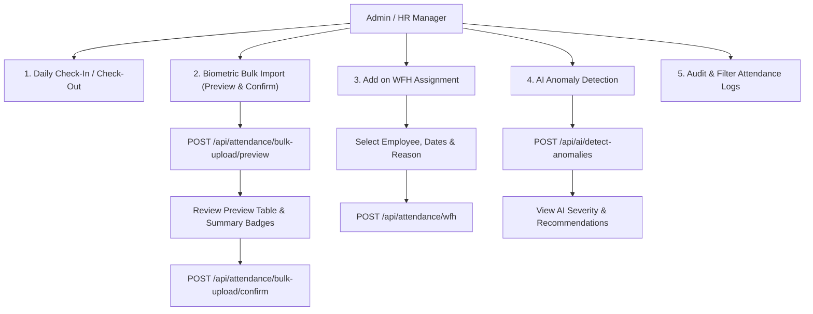

# Attendance Management Page Flow & Architecture Guide

The **Attendance Management Page** (`/admin/attendance`) is the operational control center in the WorkforceOS HR & Attendance Portal for tracking daily attendance, running biometric uploads, assigning Work From Home (WFH), analyzing AI anomalies, and auditing employee time logs.

---

## 1. System Map & Core Files

| Role / Module | File Path | Purpose |
| :--- | :--- | :--- |
| **Page Route** | [`nextjs-frontend/app/(dashboard)/admin/attendance/page.js`](file:///c:/Users/Pooja/attendance-portal/nextjs-frontend/app/%28dashboard%29/admin/attendance/page.js) | Next.js route wrapper for `/admin/attendance` |
| **Main Component** | [`nextjs-frontend/components/pages/admin/AttendanceManagement.js`](file:///c:/Users/Pooja/attendance-portal/nextjs-frontend/components/pages/admin/AttendanceManagement.js) | Admin & HR Attendance dashboard component |
| **CSS Modules** | [`nextjs-frontend/components/pages/admin/AttendanceManagement.module.css`](file:///c:/Users/Pooja/attendance-portal/nextjs-frontend/components/pages/admin/AttendanceManagement.module.css) [`nextjs-frontend/components/pages/admin/UrgentWfh.module.css`](file:///c:/Users/Pooja/attendance-portal/nextjs-frontend/components/pages/admin/UrgentWfh.module.css) | Scoped CSS for records table, preview modal, WFH modal, and AI anomaly cards |
| **Frontend API** | [`nextjs-frontend/services/attendanceApi.js`](file:///c:/Users/Pooja/attendance-portal/nextjs-frontend/services/attendanceApi.js) | Axios service methods (`getAllAttendance`, `previewAttendanceUpload`, `confirmAttendanceImport`, `assignWfh`, `deleteAttendance`) |
| **Backend Engine** | [`backend/src/services/attendancePolicyService.js`](file:///c:/Users/Pooja/attendance-portal/backend/src/services/attendancePolicyService.js) | Core policy engine (calculates worked hours, late flags, short hours, overtime, weekend rules, and synthetic WFH) |
| **Backend Controllers** | [`backend/src/controllers/attendanceController.js`](file:///c:/Users/Pooja/attendance-portal/backend/src/controllers/attendanceController.js) [`backend/src/controllers/attendanceBulkController.js`](file:///c:/Users/Pooja/attendance-portal/backend/src/controllers/attendanceBulkController.js) | Express endpoints for CRUD attendance, biometric file parsing, and WFH assignment |

---

## 2. End-to-End Operational Workflows

---

### Workflow A: Daily Attendance Check-In / Check-Out
1. Employees log punch times via the web portal or biometric device.
2. The server records `checkIn` and `checkOut` timestamps in IST (`Asia/Kolkata` time zone).
3. `attendancePolicyService` evaluates the record against global settings (`officeStartTime`, `lateThreshold`, `fullDayRequiredHours`, `halfDayRequiredHours`):
   * `workedHours = (checkOut - checkIn) / 3600000`
   * `isLate = checkInTime > lateThreshold` (e.g. after 10:00 AM)
   * `shortHours = Math.max(0, requiredHours - workedHours)`
   * `overtimeHours = Math.max(0, workedHours - requiredHours)`
4. Status is assigned (`Present`, `Half Day`, `Absent`, `Late`, `Missing Punch`, `Short Time`).

---

### Workflow B: Biometric Bulk Import & Two-Phase Confirmation
1. **File Selection**: Admin clicks **Upload Biometric** and selects a file (`.csv`, `.xlsx`, `.xls`, `.pdf`).
2. **Phase 1 — Parsing & Preview (`POST /api/attendance/bulk-upload/preview`)**:
   * File is processed using intelligent parsers (supports standard tabular files, Grok AI mapping, or monthly biometric report formats).
   * Employees are matched automatically by **Biometric ID**, **Employee Code**, or **Name**.
   * Backend generates a preview object (`importPreview`) containing summary stats (`Total Rows`, `Importable`, `Biometric Matches`, `Code Matches`, `Unmatched`, `Invalid`, `Duplicates`).
3. **Phase 2 — Review & Confirm (`POST /api/attendance/bulk-upload/confirm`)**:
   * Admin reviews the preview table showing matched employee names, biometric IDs, check-in/out times, and validation issues (`canImport: true/false`).
   * Clicking **Confirm Import** upserts valid records into MongoDB skipping duplicates, and displays an import result banner (`Saved`, `Updated`, `Duplicates skipped`, `Invalid skipped`).

---

### Workflow C: Direct Work From Home (WFH) Assignment
1. Admin clicks **Add on WFH** button.
2. Selects an active employee, date range (`From Date` to `To Date`), and enters a mandatory reason.
3. Submits `POST /api/attendance/wfh`.
4. System creates or updates attendance/leave records with `workMode: 'wfh'`, `dayType: 'Work From Home'`, and `timeStatus: 'WFH'`.
5. Ensures employees assigned WFH are counted as Present without missing punch penalties.

---

### Workflow D: AI Anomaly Detection
1. Admin clicks **AI Anomalies** button.
2. Sends a request to `POST /api/ai/detect-anomalies` for the active month and year.
3. AI engine analyzes attendance records for suspicious patterns:
   * Frequent late arrivals
   * Missing checkout punches
   * Unexplained short working hours
   * Irregular punch sequences
4. Renders an interactive anomaly card grid showing severity badges (`high`, `medium`, `low`), employee details, issue descriptions, and actionable HR recommendations.

---

### Workflow E: Audit, Filtering, & Deletion
1. **Quick Date Presets**: One-click filters for **Today**, **This Week**, **This Month**, and **Last Month**.
2. **Advanced Multi-Filters**:
   * Employee search with autocomplete dropdown
   * Department dropdown
   * Date Range (`From` / `To`)
   * Status (`Present`, `Full Day`, `Half Day`, `Absent`, `Holiday`, `Weekend`, `On Leave`)
   * Time Status (`On Track`, `WFH`, `Late`, `Missing Punch`, `Short Time`, `Weekly Off`)
   * Late-only filter toggle
3. **Sorting**: Sort by Date, Worked Hours, Required Hours, Short Hours, Extra Hours, or Late Check-In (ascending/descending).
4. **Record Deletion**: Authorized admins can delete individual attendance records via **Delete** button with confirmation prompt.

---

## 3. Policy & Calculation Reference Table

| Parameter / Metric | Logic / Formula | Notes |
| :--- | :--- | :--- |
| **Worked Hours** | `(checkOut - checkIn) / 3600000` | Calculated in hours rounded to 2 decimal places |
| **Required Hours** | Weekdays: `fullDayRequiredHours` (9h) Saturdays: `saturdayRequiredHours` (4h) Holidays/Weekends: 0h | Defined in `Settings.getGlobal()` |
| **Late Threshold** | `checkInTime > lateThreshold` | Default threshold: `10:00 AM` |
| **Short Hours** | `Math.max(0, requiredHours - workedHours)` | Deficit working hours below required |
| **Overtime Hours** | `Math.max(0, workedHours - requiredHours)` | Extra working hours beyond required |
| **Status Categories** | `Present`, `Half Day`, `Absent`, `Holiday`, `Weekend`, `On Leave` | Core attendance statuses |
| **Time Statuses** | `On Track`, `WFH`, `Late`, `Missing Punch`, `Short Time`, `Worked on Holiday`, `Weekly Off` | Detailed time tracking flags |

---

## 4. API Reference Summary

| Method | Endpoint | Authorization | Description |
| :--- | :--- | :--- | :--- |
| `GET` | `/api/attendance` | `attendance:view_all` | Fetches paginated, filtered attendance records |
| `POST` | `/api/attendance/checkin` | `attendance:checkin` | Employee self check-in punch |
| `POST` | `/api/attendance/checkout` | `attendance:checkout` | Employee self check-out punch |
| `POST` | `/api/attendance/wfh` | `attendance:manage_wfh` | Assigns direct WFH to employee |
| `POST` | `/api/attendance/bulk-upload/preview` | `attendance:import` | Parses and previews biometric file upload |
| `POST` | `/api/attendance/bulk-upload/confirm` | `attendance:import` | Confirms biometric import into database |
| `DELETE` | `/api/attendance/:id` | `attendance:manage_wfh` | Deletes an attendance record |
| `POST` | `/api/ai/detect-anomalies` | `attendance:view_all` | Runs AI anomaly detection for month |
