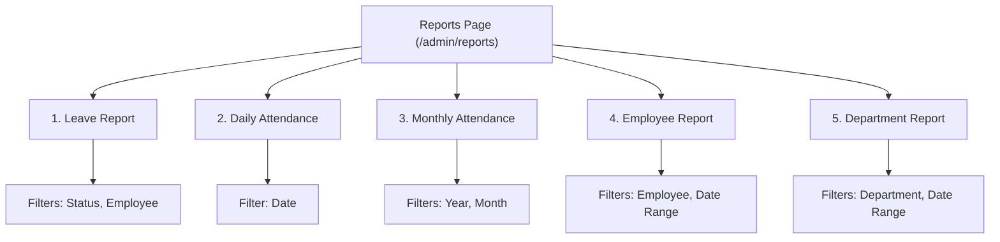

# Reports Page Documentation & Overview

The **Reports Page** (`/admin/reports`) in the WorkforceOS HR & Attendance Portal is an administrative hub for generating, analyzing, filtering, and exporting attendance and leave reports across the organization.

---

## 1. File Architecture & Key Locations

| Component | File Path | Description |
| :--- | :--- | :--- |
| **Page Route** | [`nextjs-frontend/app/(dashboard)/admin/reports/page.js`](file:///c:/Users/Pooja/attendance-portal/nextjs-frontend/app/%28dashboard%29/admin/reports/page.js) | Next.js route wrapper for `/admin/reports` |
| **Main Component** | [`nextjs-frontend/components/pages/admin/Reports.js`](file:///c:/Users/Pooja/attendance-portal/nextjs-frontend/components/pages/admin/Reports.js) | Interactive UI component with tabs, filters, stats, table, & CSV export |
| **CSS Styling** | [`nextjs-frontend/components/pages/admin/Reports.module.css`](file:///c:/Users/Pooja/attendance-portal/nextjs-frontend/components/pages/admin/Reports.module.css) | Scoped CSS styles for layout, tables, buttons, and filter cards |
| **Frontend API** | [`nextjs-frontend/services/reportApi.js`](file:///c:/Users/Pooja/attendance-portal/nextjs-frontend/services/reportApi.js) | Axios API client for report endpoints |
| **Backend Routes** | [`backend/src/routes/reports.js`](file:///c:/Users/Pooja/attendance-portal/backend/src/routes/reports.js) | Express router definition for `/api/reports` endpoints |
| **Backend Controller** | [`backend/src/controllers/reportController.js`](file:///c:/Users/Pooja/attendance-portal/backend/src/controllers/reportController.js) | Backend report generation, WFH correlation, & multi-format export logic |

---

## 2. Report Tabs & Functional Capabilities

The page features 5 primary report tabs suited for different administrative needs:

### 1. Leave Report (`tab === 'leave'`)
* **Purpose**: Overview of all leave applications across the organization.
* **Available Filters**:
  * **Status**: `All`, `Pending`, `Approved`, `Rejected`
  * **Employee**: Filter by specific active employee
* **Key KPI Cards**:
  * **Total Applications**: Count of all leave records matching filter
  * **Pending**: Applications awaiting approval
  * **Approved**: Total approved applications
  * **Unplanned**: Total unplanned leave applications
  * **Total Days**: Sum of approved day-based leave durations
* **Table Columns**: Employee, Emp ID, Department, Leave Type, From, To, Days/Hours, Mode (Planned/Unplanned), Status, Project, Applied On.

### 2. Daily Attendance (`tab === 'daily'`)
* **Purpose**: Audit attendance activity on a single calendar day.
* **Available Filters**: Date picker (defaults to today).
* **Key KPI Cards**: Total Records, Present, Absent, Late Arrivals, Average Working Hours.
* **Table Columns**: Employee, Emp ID, Department, Date, Status, Work Mode (Office/WFH), Check In, Check Out, Working Hours, Late (Yes/No).

### 3. Monthly Attendance (`tab === 'monthly'`)
* **Purpose**: Organizational attendance summary for an entire calendar month.
* **Available Filters**: Year input and Month dropdown.
* **Key KPI Cards**: Total Records, Present Count, Absent Count, Late Count, Average Working Hours.

### 4. Employee Report (`tab === 'employee'`)
* **Purpose**: Individual attendance & leave history for a single employee over a date range.
* **Available Filters**: Required Employee dropdown + Date Range (`From` and `To`).
* **Output**: Combines attendance logs and non-WFH leave requests into a unified timeline table.

### 5. Department Report (`tab === 'department'`)
* **Purpose**: Comprehensive team attendance & leave performance by department.
* **Available Filters**: Required Department dropdown + Date Range (`From` and `To`).
* **Output**: Fetches all active employees in the selected department and aggregates their attendance and leave records.

---

## 3. Special Features & Business Logic

### A. Synthetic WFH Record Correlation (`getAttendanceWithWfh`)
* When generating attendance reports, the backend inspects approved Work From Home (WFH) leave records for the date range.
* If an employee has an approved WFH leave on a date but lacks a physical check-in record in the `Attendance` collection, the backend dynamically constructs a **synthetic attendance record** (`source: 'wfh_leave'`, `status: 'Present'`, `workMode: 'wfh'`).
* **Benefit**: Ensures employees on approved WFH are accurately reflected as Present in daily, monthly, employee, and department attendance reports.

### B. Instant CSV & Multi-Format Export
1. **Client-Side CSV Export**:
   * Standardized CSV generator (`exportToCSV`) builds raw CSV data directly in the browser with quote escaping.
   * Downloads immediately without an extra round-trip server request.
2. **Server-Side Export API (`/api/reports/export`)**:
   * Supports `csv`, `xlsx` (ExcelJS workbook with column headers), and `pdf` (PDFKit document formatting).

### C. Status Color Badging
Interactive color badges provide visual clarity for table status values:
* **Approved / Present**: Green background (`#dcfce7`), dark green text (`#166534`)
* **Pending**: Yellow background (`#fef9c3`), dark gold text (`#854d0e`)
* **Rejected / Absent**: Red background (`#fee2e2`), dark red text (`#991b1b`)
* **Late / Half Day**: Amber background (`#fef3c7`), amber-brown text (`#92400e`)

---

## 4. API Reference Summary

| Method | Endpoint | Query Parameters | Description |
| :--- | :--- | :--- | :--- |
| `GET` | `/api/reports/daily` | `date=YYYY-MM-DD` | Fetches daily attendance with WFH synthesis |
| `GET` | `/api/reports/monthly` | `year=YYYY&month=MM` | Fetches monthly attendance records |
| `GET` | `/api/reports/employee/:id` | `startDate=...&endDate=...` | Fetches single employee attendance + leaves |
| `GET` | `/api/reports/department` | `department=...&startDate=...&endDate=...` | Fetches department attendance + leaves |
| `GET` | `/api/reports/export` | `format=csv\|xlsx\|pdf&type=...` | Streams formatted binary/text export file |

---

## 5. Usage Workflow for Administrators

1. **Select Tab**: Choose between *Leave Report*, *Daily Attendance*, *Monthly Attendance*, *Employee Report*, or *Department Report*.
2. **Configure Filters**: Select desired status, employee, department, month, or date range.
3. **Click Generate**: Fetches and renders live stat cards and formatted data tables.
4. **Export Report**: Click **Export CSV** at top-right or bottom-right of the table to download a spreadsheet report.
